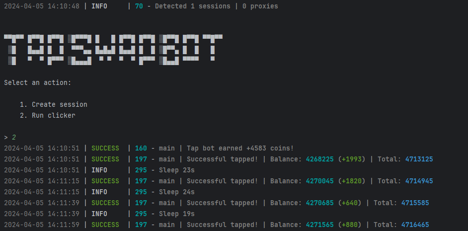

[](https://t.me/sho6ot)




> 🇪🇳 README in english available [here](README-EN.md)

## Functionality
| Functionality | Supported |
|------------------------------------------------ ---------------|:--------------:|
| Multithreading | ✅ |
| Binding a proxy to a session | ✅ |
| Auto-purchase of items if you have coins (tap, energy, charge) | ✅ |
| Random sleep time between clicks | ✅ |
| Random number of clicks per request | ✅ |
| Support tdata / pyrogram .session / telethon .session | ✅ |


## [Settings](https://github.com/shamhi/TapSwapBot/blob/main/.env-example)
| Setting | Description |
|-------------------------|--------------------- -------------------------------------------------- -----------------------|
| **API_ID / API_HASH** | Platform data from which to launch a Telegram session _(stock - Android)_ |
| **MIN_AVAILABLE_ENERGY** | The minimum amount of available energy, upon reaching which there will be a delay _(eg 100)_ |
| **SLEEP_BY_MIN_ENERGY** | Delay when reaching minimum energy in seconds ✅
| **ADD_TAPS_ON_TURBO** | How many taps will be added when turbo is activated ✅
| **AUTO_UPGRADE_TAP** | Should I improve the tap ✅
| **MAX_TAP_LEVEL** | Maximum level of tap pumping ✅
| **AUTO_UPGRADE_ENERGY** | Whether to improve energy ✅
| **MAX_ENERGY_LEVEL** | Maximum level of energy pumping ✅
| **AUTO_UPGRADE_CHARGE** | Whether to improve the energy charge ✅
| **MAX_CHARGE_LEVEL** | Maximum level of energy charge pumping ✅
| **APPLY_DAILY_ENERGY** | Should I use the daily free energy boost ✅
| **APPLY_DAILY_TURBO** | Should I use the daily free turbo boost ✅
| **RANDOM_CLICKS_COUNT** | Random number of taps ✅
| **SLEEP_BETWEEN_TAP** | Random delay between taps in seconds ✅
| **USE_PROXY_FROM_FILE** | Should I use a proxy from the file `bot/config/proxies.txt`✅

## Quick start 📚
1. To install libraries on Windows, run INSTALL.bat.
2. To start the bot, use `START.bat` (or in the console: `python main.py`).

## Prerequisites
Before you begin, make sure you have the following installed:
- [Python](https://www.python.org/downloads/) version 3.10 or 3.11.

## Obtaining API keys
1. Go to the website [my.telegram.org](https://my.telegram.org) and log in using your phone number.
2. Select **"API development tools"** and fill out the form to register a new application.
3. Record the `API_ID` and `API_HASH` in the `.env` file provided when you registered your application.

## Installation
You can download [**Repository**](https://github.com/KayNguyen97/TapSwapBot) by cloning it to your system and installing the necessary dependencies:
```shell
~ >>> git clone https://github.com/KayNguyen97/TapSwapBot.git
~ >>> cd TapSwapBot

#Linux
~/TapSwapBot >>> python3 -m venv venv
~/TapSwapBot >>> source venv/bin/activate
~/TapSwapBot >>> pip3 install -r requirements.txt
~/TapSwapBot >>> cp .env-example .env
~/TapSwapBot >>> nano .env # Here you must specify your API_ID and API_HASH , the rest is taken by default
~/TapSwapBot >>> sh install.sh
~/TapSwapBot >>> python3 main.py

#Windows
~/TapSwapBot >>> python -m venv venv
~/TapSwapBot >>> venv\Scripts\activate
~/TapSwapBot >>> pip install -r requirements.txt
~/TapSwapBot >>> copy .env-example .env
~/TapSwapBot >>> # Specify your API_ID and API_HASH, the rest is taken by default
~/TapSwapBot >>> python main.py
```

Also for quick launch you can use arguments, for example:
```shell
~/TapSwapBot >>> python3 main.py --action (1/2/3)
# Or
~/TapSwapBot >>> python3 main.py -a (1/2/3)

#1 - Creates a session
#2 - Launches the clicker
#3 - Launch via Telegram
```